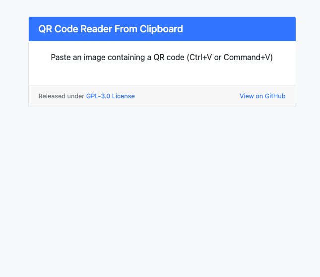

# QR Code Reader

A simple, browser-based QR code reader that works directly from your clipboard

## Usage

1. Visit [qr.djkaasstengel.nl/](https://qr.djkaasstengel.nl/)
2. Copy any image containing a QR code
3. Paste (Ctrl+V or Command+V) into the page
4. Get the decoded URL and copy it with one click

